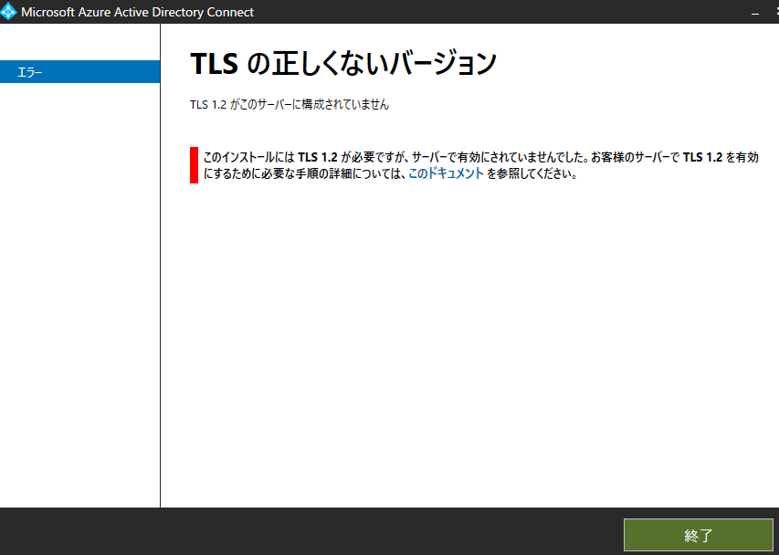

# Azure AD Connect v2 の更新情報

こんにちは、Azure Identity サポート チームの平形です。
今回は 6 月にリリースされた Azure AD Connect v2 についてご案内いたします。
v2 ということで、メジャー アップデート版となりますが、見た目上は大きく変わったところはございません。しかしながら、内部では同期の効率化・変更が多く加わっており、これを機にぜひアップグレードをご検討ください。

本記事執筆時点では Azure AD Connect 2.0.3.0 にてリリースされておりますため、 2.0.3.0 を基に記載しております。新たな情報が更新され次第、順次更新を行います。

| 更新日時  | 更新内容  |
| ------------ | ------------ |
| 2021/8/3  | 新規公開  |

## 目次
1. [Azure AD Connect V2 新機能](#anchor1)
2. [ローカル DB にインストールされる SQL が SQL Server 2019 コンポーネントに変更されました](#anchor2)
3. [OS 要件が Windows Server 2016 以降となりました](#anchor3)
4. [Windows PowerShell 5.0 が必要となりました](#anchor4)
5. [TLS 1.2 のみをサポートするように更新されました](#anchor5)
6. [Azure AD Connect インストール時、Hybrid Identity Administrator 権限でインストールが可能となりました](#anchor6)
7. [オンプレミス管理者権限を持つオブジェクトに対する書き戻し処理に必要な権限が付与されなくなりました](#anchor7)
8. [パスワードハッシュ同期機能が改善されました](#anchor8)
9. [v2 エンドポイントを使用するようになりました](#anchor9)
10. [既定の同期対象属性が追加されました](#anchor10)
11. [Azure AD Connect v2 に関する FAQ](#anchor11)

---
<a id="anchor1"></a>

## Azure AD Connect v2 新機能

<a id="anchor2"></a>

### ローカル DB にインストールされる SQL が SQL Server 2019 コンポーネントに変更されました
SQL Server 2019 のリリースに伴い、これまで同梱されていた SQL Server 2012 LocalDB (Express 版) が、SQL Server 2019 LocalDB にアップデートされました。
なお、現時点で同梱されている SQL Server 2012 LocalDB (Express 版) ではなく製品版の SQL Server ご利用されている場合は何も影響はございません。

<a id="anchor3"></a>

### OS 要件が Windows Server 2016 以降となりました
Azure AD Connect v2 をインストールするサーバーは Windows Server 2016 以降である必要があります。SQL Server 2019 の要件として Windows Server 2016 以降である必要があるためです。
可能な限り Windows Server 2016 以降の Windows Server OS をご利用をご検討いただきたいとは思いますが、どうしても Windows Server 2016 以前の OS をご利用頂きたい場合には Azure AD Connect 1.6.4.0 をご利用ください。
現時点では下記 URL よりダウンロードが可能となっております。

[AADC 1.6.4.0 ダウンロードサイト](https://www.microsoft.com/en-us/download/details.aspx?id=103336)

<a id="anchor4"></a>

### Windows PowerShell 5.0 が必要となりました
Azure AD Connect v2 では PowreShell バージョン 5.0 が必要となりました。
ただし、PowerShell 5.0 は Windows Server 2016 に同梱されている為、別途インストールは不要です。

<a id="anchor5"></a>

### TLS 1.2 のみをサポートするように更新されました
AADC v2 では TLS 1.2 のみをサポートするように更新されました。
もしサーバーで TLS 1.2 が無効化されている場合、AADC のインストール時にエラーとなります。
インストール時に以下のようなエラーが発生します。



この場合は下記公開情報記載の PowerShell コマンドを実行頂き TLS 1.2 を有効化したうえで再度ウィザードを実行ください。

[Azure AD Connect に対する TLS 1.2 の強制 | TLS 1.2 を有効にする PowerShell スクリプト](https://docs.microsoft.com/ja-jp/azure/active-directory/hybrid/reference-connect-tls-enforcement#powershell-script-to-enable-tls-12)


<a id="anchor6"></a>

### Azure AD Connect インストール時、Hybrid Identity Administrator 権限でインストールが可能となりました
Azure AD Connect のインストール時、これまでは Azure AD のグローバル管理者の資格情報が必須となっていましたが、代わりに Hybrid Identity Administrator (ハイブリッド ID の管理者) の役割を持つユーザーの資格情報を用いてインストールが可能です。

Hybrid Identity Administrator の役割については以下をご参照ください。<br> [Azure AD の組み込みロール - Azure Active Directory | Microsoft Docs - ハイブリッド ID の管理者](https://docs.microsoft.com/ja-jp/azure/active-directory/roles/permissions-reference#hybrid-identity-administrator)

<a id="anchor7"></a>

### オンプレミス管理者権限を持つオブジェクトに対する書き戻し処理に必要な権限が付与されなくなりました
Azure AD Connect 新規インストール時、 Azure AD Connect インストール ウィザード内でサービス アカウントを自動生成する場合のみ影響します。
Windows セキュリティ ガイドラインに基づき、Active Directory の AdminSDHolder オブジェクトへはアクセス許可を付与しないように変更されました。そのため、管理者権限を持つオブジェクトに対する書き戻し処理はエラーとなります。

Azure AD Connect の初回インストール時にウィザード内でサービス アカウントを作成するように設定していた場合、 MSOL_XXXXXX というアカウントがオンプレミス AD 上に作成されます。<br>
これまでは Azure AD Connect インストール ウィザードを進める中で自動的に AdminSDHolder に対して MSOL_XXXXXX というアカウントが書き戻しできるようにすべてのプロパティに対して読み取り・書き込み権限が付与されましたが、今後新規インストール時には付与されない動作と変更が加わりました。

管理者ユーザーに対しても属性値、およびパスワードをライトバックできるようにしたい場合には、別途個別に AdminSDHolder に対して権限付与を行う必要があります。

<a id="anchor8"></a>

### パスワードハッシュ同期機能が改善されました
Active Directory にてユーザーの "次回ログオン時にパスワードの変更が必要" プロパティからチェックが外された場合、すなわちパスワードの有効期限が切れていた状態から再度有効になった場合、パスワードが有効になったことと、パスワードハッシュが Azure AD へ同期されます。
これまでは "次回ログオン時にパスワードの変更が必要" のチェックを外しただけではパスワードが同期されず、改めてパスワードを変更しなければパスワードが同期されませんでした。 Azure AD Connect v2 からはチェックを外すと定期的なパスワード ハッシュ同期が発生したタイミングで自動で Azure AD に同期されるようになります。

<a id="anchor9"></a>

### v2 エンドポイントを使用するようになりました
AADC v2 では、Azure AD の v2 エンドポイントに接続して同期処理を行います。
これにより、1 グループのメンバーとして 250,000 ユーザーを同期できるようになりました。(従来は 50,000 メンバーが上限)
<Br>
また、v2 エンドポイントはパフォーマンスの面でも優れています。過去事例では、これまで完全同期に 8 時間ほど掛かっていたところ、v2 エンドポイントに切り替えたことで 3 時間に短縮されたとの報告もありますので、ぜひお試しください。

なお、v2 エンドポイントは、AADC 1.5.30.0 以降であればご利用いただけます。

少し分かりづらいですが、AADC のバージョン 2.x と Azure AD 側の v2 のエンドポイントはリリースのタイミングなどが異なるため、v2 エンドポイントの詳細については、下記公開情報をご参照ください。

[Azure AD Connect 同期 V2 エンドポイント API](https://docs.microsoft.com/ja-jp/azure/active-directory/hybrid/how-to-connect-sync-endpoint-api-v2)

<a id="anchor10"></a>

### 既定の同期対象属性が追加されました
以下のユーザー属性が、新たに Azure AD に同期されるようになりました。
	- employeeType
	- employeeHireDate

<br>

<a id="anchor11"></a>

## Azure AD Connect v2 に関する FAQ
---
**Q: v2 エンドポイントが既定のエンドポイントになるのはいつからですか。**

**A: Azure AD Connect のバージョン 2.x 以降では v2 のエンドポイントが既定のエンドポイントとなっています。**

バージョン 1.5.30 以降は v2 エンドポイントがサポートされておりますが、既定は v1 が使用されます。 v2 を利用したい場合には手動での切り替えが必要です。

---

**Q: Azure AD Connect v2 のエンドポイント URL は v1 から変更は無いでしょうか。**

**A: はい、エンドポイントの URL に変更はありません。**

今までと同様に以下の公開情報通りの URL を利用します。エンドポイントに接続後の処理が従来の v1 と v2 では異なります。
そのため、プロキシサーバーなどで Azure AD Connect がアクセスするエンドポイント URL を制限されている環境においては特別な追加対応は不要となります。

[ハイブリッド ID で必要なポートとプロトコル - Azure | Microsoft Docs](https://docs.microsoft.com/ja-jp/azure/active-directory/hybrid/reference-connect-ports)
<br> [Azure AD Connect:Azure AD 接続性に関する問題のトラブルシューティング | Microsoft Docs](https://docs.microsoft.com/ja-jp/azure/active-directory/hybrid/tshoot-connect-connectivity)

---

**Q: どちらのエンドポイントに接続しているか確認する方法はありますか。**

**A: 以下のコマンドを実行します。**

```PowerShell
Get-ItemProperty 'HKLM:\SYSTEM\CurrentControlSet\Services\ADSync\Parameters' | Select-Object AadConnector*ApiVersion
```

値が空の場合は v1 に接続していることを示します。


値が以下のように表示される場合は v2 に接続していることを示します。


---
**Q: インプレース アップグレードは可能でしょうか。**

**A: 今まで通り可能です。**

Windows Server 2016 以降である必要がありますが、弊社の検証環境では 1.3.x から 2.0.3.0 へのインプレース アップグレードが可能なことを確認しております。同期ルールを手動で変更・追加を行っている環境では変化が生じる可能性もございますので、必ず本番環境と同じ設定を行っているテスト環境での検証、または本番のステージングサーバーを利用したスイング移行が可能であるかをご確認頂いてからの実施をお勧めいたします。
検証環境で何らかの理由で正常にアップグレードが行えなかった場合には、別途新規サーバーをご用意いただき、新規サーバー上で新規に Azure AD Connect v2 をインストール頂き構築することをご検討ください。

---
**Q: Azure AD Connect v2 は Windows Server 2016 以降に対応していますが、Windows Server 2012 R2 など未対応の OS の場合はどうすればよいですか。**

**A: Azure AD Connect 1.6.4.0 をダウンロードしてご利用ください。**

---
**Q: Azure AD Connect のバージョンアップ方法を教えてください**

**A: 弊社サポート チームでアップグレード手順をご案内差し上げておりますので、以下ブログを参考にアップグレードを実施ください。**

[Azure AD Connect アップグレード手順詳細](https://jpazureid.github.io/blog/azure-active-directory-connect/how-to-upgrade-details/)

手順としては 1.5.45.0 へのアップグレード手順としてご案内差し上げておりますが、 2.0.3.0 でもご利用可能です。
<br>また、アップグレード前に問題がないかを確認する際にはステージング モードで事前に Export される情報を確認されることをお勧めいたします。合わせてステージング モードについてのブログも参照ください。

[ステージング サーバーのすゝめ](https://jpazureid.github.io/blog/azure-active-directory-connect/introduction-staging-server/)

「3.どうやって大きな作業に向けた事前確認で安心できるの？」の項目をご連絡ください。

---
**Q: Azure AD Connect インストール済みの環境で OS アップグレードは可能ですか。**

**A: いいえ、 Azure AD Connect インストール済みの環境での OS アップグレードはできません。**

現在 Windows Server 2012 R2 をご利用いただいている場合、 Azure AD Connect V2 を利用するには OS バージョンをアップグレードをする必要があります。しかし、 Azure AD Connect インストール済みの環境で OS をアップグレードすることは非サポートとなります。<br>そのため、現在 Windows Server 2012 R2 環境で Azure AD Connect をご利用頂いている場合には、別に Windows Server 2016 以降のサーバー OS をインストールしたサーバーを用意し、スウィング移行を実施して Azure AD Connect v2 にアップグレードする必要があります。

---

いかがでしたでしょうか。メジャー アップデートに伴い様々な機能が強化されておりますので、是非アップグレードをご検討頂けますと幸いです。不明な点はお気軽にサポート窓口までお問い合わせください。
